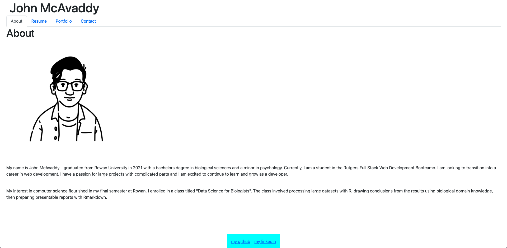

# React Portfolio

## Description
I created this portfolio to practice React and share my work with other developers.

## Table of Contents
- [React Portfolio](#react-portfolio)
  - [Description](#description)
  - [Table of Contents](#table-of-contents)
  - [Installation](#installation)
  - [Usage](#usage)
  - [License](#license)
  - [Contributing](#contributing)
  - [Tests](#tests)
  - [Preview](#preview)
  - [Questions](#questions)

## Installation
First, clone the repo to your local machine. Then, run npm install to install necessary dependencies. When you're ready to view your work, run npm run build then npm start. To deploy to GitHub Pages, run npm run deploy.

## Usage
Visit [this GitHub Pages link](https://jmcavaddy.github.io/react-portfolio/) to check it out!

## License
This project is licensed under the MIT license.  
For more information, please visit [this link](https://opensource.org/licenses/MIT).

## Contributing
Contact me via GitHub or LinkedIn to discuss contributing to this project.

## Tests
There are currently no tests available for React Portfolio.

## Preview
Preview of the about page:

## Questions
Contact me with questions regarding this software and view more of my work at my [GitHub page](https://github.com/jmcavaddy)!
